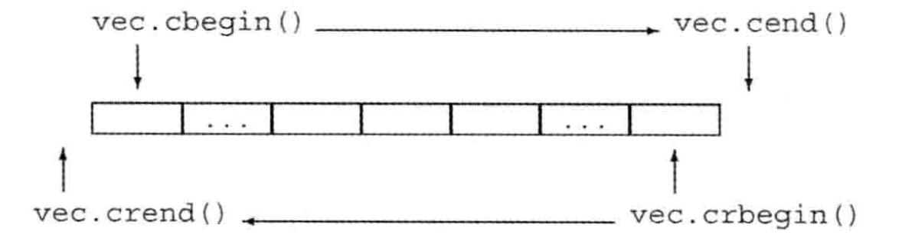
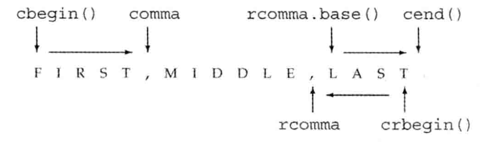

## 容器

容器是特定类型对象的集合，包括==顺序容器==和==关联容器==两类，容器都是模板类（泛型），定义在对应的同名头文件中

无论是顺序容器还是关联容器，一些通用成员和操作都是为绝大多数容器所共同支持的，小部分容器因为自身特性可能没法支持，但会额外实现自己的成员和操作来作为替代，具体可观察 IDE 的提示

### 共有类型成员

- `C::iterator/const_iterator`，容器的正向迭代器类型
- `C::reverse_iterator/const_reverse_iterator`，容器的反向迭代器类型
- `C::difference_type`，有符号整型，用于表示两个迭代器之间的距离
- `C::size_type`，无符号整型，用于表示容器大小
- `C::value_type`，元素类型
- `C::reference/const_reference`，元素左值引用类型

### 共有构造函数

- `C()`，默认构造函数
  - 对于 `array`，构造对应大小，元素值初始化的容器
  - 对于非 `array`，构造空容器

- `C(c)`，以指定容器为原本构造副本容器，**容器类型必须严格相等**
- `C(ib, ie)`，以迭代器范围 `[ib, ie)` 中的值为初始元素构造容器
- `C(il)`，以初始化列表中的值为初始元素构造容器

构造使用容器作为数据源（对应构造函数 `C(c)`），两者容器类型必须严格相等；但如果使用迭代器范围或初始化列表作为数据源（对应构造函数 `C(ib, ie)` 和 `C(il)`），只要元素类型能转换，不强求容器类型相等

```c++
vector<double> vd = {1, 2, 3}; // 正确，整型可以转换为浮点
vector<int> vi1(v2.begin(), v2.end()); // 正确，浮点类型可转换为整型
vector<int> vi2 = vd; // 错误，容器类型必须严格相等（包括元素类型）
```

另外还有两个构造函数为顺序容器共有（除去 `array`），用于在构造时指定容器大小

- `C(n)`，构造大小为 `n`，元素值初始化的容器
- `C(n, v)`，构造大小为 `n`，元素都为 `v` 副本的容器

### 共有赋值操作

- `swap(c1, c2)/c1.swap(c2)`，交换两个容器的元素，通常会比赋值拷贝快
- `c.assign(ib, ie)`，将容器内容替换为迭代器范围 `[ib, ie)` 中的值
- `c.assign(il)`，将容器内容替换为初始化列表 `il` 中的值
- `c.assign(n, v)`，将容器内容替换为 `n` 个指定值 `v`

> **`assign` 操作会使容器内的迭代器、引用和指针失效，但是 `swap` 操作不会**（因为 `swap` 只交换的两个容器的数据结构，元素本身并没有移动，`string` 除外）
>
> `assign` 操作不适用于定长 `array` 和关联容器

### 共有大小操作

- `c.size()`，获取容器元素数量
- `c.max_size()`，获取容器能承载的元素数量上限
- `c.empty()`，判断是否为空容器

### 共有比较操作

顺序容器都支持相等运算符（`== / !=`），除了无序关联容器的容器都支持关系运算符（`> / >= / < / <=`）

容器比较操作的实质是对元素进行逐个比较，**因此容器能比较的前提是元素支持对应的比较操作**（容器的相等性比较需要元素实现 `==`，容器的大小性比较需要元素实现 `<`）

> 容器比较要求两个容器类型严格相等

### 共有元素操作

- `c.insert(args)`系列函数，将指定的若干个元素副本插入到容器的指定位置
- `c.emplace(args)`系列函数，构造一个元素插入到容器的指定位置
- `c.erase(args)`，删除指定元素
- `c.clear()`，清空容器

不同类型的容器入参定义不同，将在后续介绍

## 顺序容器及其操作

顺序容器提供了控制元素存储和访问顺序的能力，主要分成四大类，可根据实际场景选用

- 数组：包括==不定长数组 vector==、==定长数组 array==，可随机访问
- 队列：只有==双端队列 deque==，可随机访问，在两端插入/删除性能高
- 链表：包括==双向链表 list==、==单向链表 forward_list==，不支持随机访问，任意位置插入/删除性能高
- 字符串：只有==不定长字符串 string==，可随机访问

> 和数组一样，**`array` 的大小是类型的一部分**，由第二个泛型参数指明，如 `array<int, 10> a;`

### 插入元素

插入元素操作可以分成三类

- 头部插入（仅链表和双端队列适用），`c.push_front(v)/c.emplace_front(inits)`，在头部插入指定元素 `v` 或者以 `inits` 构造元素插入到头部
- 尾部插入，`c.push_back(v)/c.emplace_back(inits)`，在尾部插入指定元素 `v` 或者以 `inits` 构造元素插入到尾部
- 指定位置之前插入，**返回指向第一个插入元素的迭代器**
  - `c.insert(ip, v)`，在指定位置 `ip`（迭代器，下同）之前插入指定元素 `v`
  - `c.insert(ip, n, v)`，在指定位置之前插入 `n` 个指定元素 `v`
  - `c.insert(ip, ib, ie)`，在指定位置之前插入迭代器范围 `[ib, ie)` 中的元素
  - `c.insert(ip, il)`，在指定位置之前插入初始化列表 `il` 中的元素
  - `c.emplace(ip, inits)`，以 `inits` 构造元素插入到指定位置之前

> 容器插入操作实际上插入的是目标元素的副本（`assign` 操作同理）

### 删除元素

- 头部删除（仅链表和双端队列适用），`c.pop_front()`，无返回值
- 尾部删除（单向链表不适用），`c.pop_back()`，无返回值
- 指定位置删除，**返回指向最后一个被删元素之后元素的迭代器**
  - `c.erase(ip)`，删除指定位置的元素
  - `c.erase(ib, ie)`，删除指定范围 `[ib, ie)` 范围中的元素
  - `c.clear()`，删除所有元素

### 访问元素

- `c.front()`，获取首元素引用
- `c.back()`，获取尾元素引用（单向链表不适用）
- `c[n]/c.at(n)`，获取下标为 `n` 的元素引用**（仅随机访问容器支持）**，其中 `c.at(n)` 是安全的随机访问，会在越界访问时抛异常

> 无论是插入、删除还是访问元素，需确保目标位置（迭代器/下标）未越界

### 改变容器大小

`c.resize(n, [v])` 可以改变容器的大小，若 `n` 大于当前大小则截断容器；若 `n` 小于当前大小则使用指定值 `v` 填充剩余位置（未指定则值初始化）

### 单向链表特有操作

单向链表不支持 `insert/erase()`，他有自己的一套插入/删除元素的操作。**要在单向链表的某个位置上进行操作，必须已知这个位置的前驱**

- `lst.before_begin/cbefore_begin()`，获取指向==首前元素==（第一个元素的前一个位置，仅为标记，实际上不存在元素）的迭代器
- `lst.insert_after(args)`，其中 `args` 同 `c.insert(args)`，在指定前驱后插入指定元素，**返回指向最后一个插入元素的迭代器**
- `lst.emplace_after(ip, inits)`，以 `inits` 构造元素插入到指定前驱 `ip` 后，**返回指向插入元素的迭代器**
- `lst.erase_after(args)`，其中 `args` 同 `c.erase(args)`，删除指定前驱后的指定元素，**返回指向最后一个被删元素之后元素的迭代器**

### 字符串特有操作

插入操作的描述由两部分组成，分别是目标位置和插入内容。所有容器都支持使用迭代器 `ip` 指示目标位置，并且通过参数组合 `(n, v)/(ib, ie)/(il)` 中的一种指示插入内容

字符串额外重载了 `insert`，可以使用下标 `p` 来指示目标位置，并且通过参数组合 `strRange` 指示其他字符串中的一段作为插入内容，`strRange` 可以是如下参数组合中的一种

- `str`，插入内容是完整字符串 `str`
- `str, p, [n]`，插入内容是字符串 `str` 从下标 `p` 开始长度为 `n` 的部分（未指定长度则默认取至尾部）
- `cp, [n]`，插入内容是字符数组 `cp` 的前 `n` 个字符

> 对于插入操作，如果使用下标 `p` 来指示目标位置，那只能使用以上提到的 `strRange` 参数组合来指示插入内容，两者是绑定的

基于下标的重载函数还有删除、赋值操作

- `s.erase(p, [n])`，从下标 `p` 开始删除长度 `n` 个字符（未指定则删除至尾部）
- `s.assign(strRange)`，将字符串替换为指定内容 `strRange`

修改字符串的其他操作

- `s.append(strRange)`，将指定内容 `strRange` 串追加到字符串尾部
- `s.replace(p, n, strRange)`，下标版本目标位置替换，从下标 `p` 开始长度为 `n` 范围，替换为指定内容 `strRange`
- `s.replace(ib, ie, strRange)`，迭代器版本目标位置替换，将指定范围 `[ib, ie)` 替换为指定内容 `strRange`

字符串的搜索操作，**返回第一个匹配的下标，若未找到则返回静态标记 `string::npos`**

- `s.find/rfind(args)`，正向/反向查找目标字符串出现的位置
- `s.find_first_of/find_last_of(args)`，正向/反向查找目标字符集中任一字符出现的位置
- `s.find_first_not_of/find_last_not_of(args)`，正向/反向查找非目标字符集中任一字符出现的位置

> `args` 参数格式为 `s/c/cp, p`，从源字符串的下标 `p` 开始搜索的目标字符串/字符 `s/c/cp`
>
> 字符串搜索返回的位置为无符号整数，不应该和有符号整数混用

字符串的其他操作

- `s.substr(p, [n])`，从下标 `p` 开始截取长度为 `n` 的子串并返回（未指定则截取至尾部）
- `to_string(v)`，将其他算术类型值 `v` 转换为字符串
- `stoXXX(s)`，一系列函数，将字符串 `s` 转换为对应的算术类型，若无法转换/转换值无法承载将抛异常

### 顺序容器操作注意事项

对内存空间上连续的顺序容器（`vector` 和 `string`）

- 元素插入有可能导致空间重新分配，导致容器内所有迭代器（包括元素的指针和引用，下同）失效
- 无论是插入/删除元素都会重排目标位置之后的元素，因此目标位置之后的迭代器都会失效

对于双向队列 `deque`，头尾的操作不会影响现有迭代器的可用性；但中间的操作会触发重排导致容器内所有迭代器失效

对于链表（`list` 和 `forward_list`），新增和删除元素都不会影响现有迭代器的可用性

> 容器操作对迭代器、指针和引用的影响，取决于容器的数据结构以及容器操作对内存空间的操控
>
> **容器操作可能会导致迭代器失效**，因此如果接下来对容器进行写操作，就不建议使用变量暂存容器上的迭代器
>
> - 不要存储尾后迭代器，而是在需要的地方每次调用 `c.end()` 获取
> - 在 `insert/erase` 后利用其返回值及时更新迭代器

### 容器适配器

容器适配器包括==栈 stack==、==队列 queue==和==优先队列 priority==，他们提供了对应数据结构的相关操作。容器适配器可以默认初始化，也可以初始化时从指定的顺序容器中继承初始元素

```c++
deque<int> d({1, 2, 3});
// queue 可以从 list/deque 容器中继承初始值
queue<int> q(d); // 1-2-3
q.push(4); // 1-2-3-4
q.pop(); // 2-3-4
```

> 容器适配器对继承容器类型的要求，依赖于数据结构的特性。比如队列要求头尾插入/访问/删除，只能继承双向链表或双向队列

## 泛型算法

==泛型算法==（下称算法）是一组基于迭代器的算法，这些算法通过遍历元素并执行元素类型上的相关操作实现相关功能。所有顺序容器都提供了迭代器，因此只要容器特性允许并且元素支持相关操作，这些算法就能适用

> 算法通常定义在头文件 `<algoritm>` 中，部分数值相关的泛型算法则定义在 `<numeric>` 中
>
> **算法不依赖容器，因此算法永远不会改变容器的大小，只能基于迭代器修改或移动内部的元素**

标准库中的算法数量多达百余种，但入参结构类似，因此下面只介绍常用算法的使用，其他算法的使用可以查阅[相关文档](https://www.apiref.com/cpp-zh/cpp/algorithm.html)

一些算法接受一个迭代器范围 `[ib, ie)`（下称 `range`），并对范围内的执行指定操作

- `find(range, v)`，在指定范围 `range` 中寻找目标值 `v` 并返回其目标迭代器，若未找到则返回 `ie`
- `accumulate(range, initv)`，对指定范围中的值求和，`initv` 是初始值
- `count(range, v)`，在指定范围中统计值为 `v` 的元素个数
- `fill(range, v)`，将指定范围中的元素全写为指定值 `v`
- `replace(range, v, r)`，将指定范围中值为 `v` 的元素全替换为 `r`

一些算法接受起始迭代器和一个长度 `(ip, n)` 来表示范围，比如 `fill_n(ip, n, v)`，从位置 `ip` 开始的 `n` 个元素写为指定值 `v`

一些算法接受两个迭代器范围，同时对两个序列进行遍历操作，比如 `equal(range1, range2)`，比较两个序列是否相等**（这类接受两个序列的算法，需要保证第二个序列的长度大于等于第一个序列）**

一些算法可选择性接受一个可调用对象来实现自定义操作

- `for_eanch(range, fun)`，将指定范围中的每一个元素作为入参调用指定函数 `fun`
- `transform(range, fun)`，将指定范围中的每一个元素通过指定函数 `fun` 映射为一个新值
- `all_of/any_of/none_of(range, pred)`，判断是否范围中所有/任一/无元素让判别函数 `pred` 返回 `true`
- `sort/stable_sotr(range, [com])`，对指定范围内的元素进行排序，若没有提供比较器 `com` 则默认升序
- `unique(range, [com])`，对指定范围内的元素去重排序，使不重复的靠前，并返回最后一个不重复元素的下一个位置，若没有提供比较器 `com` 则默认使用 `==` 比较

> 带写输出的算法不检查范围合法性，开发者需确保写范围未越界

### lambda 函数

lambda 函数和普通函数、函数指针一样都是==可调用对象==，可以理解为一个匿名函数，其形式如下
```c++
/*
[captures](params) -> R {
	// 函数体
}
*/
auto compare = [](const string &a, const string &b) -> bool {
  return a.size() < b.size();
};
```
- `[captures]`，捕获列表，与闭包相关
- `(params)`，参数列表，如果是无参函数可以整个省略
- `R`，尾置返回类型，如果函数体只有一条语句则可省略并由编译器推断

当 lambda 出现在函数中时，**lambda 内部只能访问捕获列表中指示的局部变量**。局部变量的捕获方式分为==值捕获==和==引用捕获==，分别对应值传递和引用传递，两种捕获方式可以同时存在

也可以不指明要捕获的变量，在捕获列表的头部放置 `=/&` 来让编译器自动推断需要捕获的变量，称为==隐式捕获==，隐式捕获和具名捕获可以同时存在，但是具名捕获列表必须位于 `=/&` 之后

lambda 值捕获的变量默认是不可写的，如果有写的需要，需要在参数列表后加上 `mutable` 关键字将其变为==可变 lambda==

```c++
int main() {
	int num = 1;
	string s = "1";
  // 其中 num 为值捕获、s 为引用捕获
	auto lambda1 = [num, &s] {return num + stoi(s);}
  // num 值捕获，其他推断为引用捕获 
  auto lambda2 = [&, num] {}
  // s 引用捕获，其他推断为值捕获
  auto lambda3 = [=, &s] {}
  // 可变 lambda 可以在 lambda 内部修改值捕获的变量
  auto lambda4 = [num] mutable {++num;}
}
```

> 如果使用引用捕获，需确保 lambda 执行时引用捕获的变量存在 -> **函数不能返回带有局部变量引用捕获的 lambda（同样适用于值捕获的指针/迭代器）**

### bind 函数

标准库提供的 `bind(callable, arg_list)` 接受一个可调用对象 `callable` 和参数列表 `arg_list`，并返回一个新的可调用对象 `newCallable`，可实现目标**可调用对象上的参数绑定（闭包）和参数重排**

`bind` 的参数列表 `arg_list` 在参数顺序上对应着 `callable` 的参数顺序，`arg_list` 中可以包含具体要绑定的实参，也可以包含形如 `_n` 的==占位符==（位于 `std::placeholders` 空间下）

占位符用于表示 `newCallable` 对应位置的参数（比如 `_1` 表示 `newCallable` 的第一个参数），`arg_list` 中有多少个占位符就说明新的调用对象入参有多少个

```c++
bool compare(string &a, string &b) {
	return a.size() < b.size();
}
// 参数绑定：为 compare 的第一个参数绑定字符串 "abc"，compare1 的第一个参数传递给 compare 的第二个参数
auto compare1 = bind(compare, "abc", _1); // compare1("def") 等价于 compare("abc", "def")
// 参数重排：交换两个参数的身份
auto compare2 = bind(compare, _2, _1); // compare2(a, b) 等价于 compare(b, a)
```

**`bind` 绑定的实参默认是按值传递的**，如果需要按引用传递，需要使用 `ref/cref()` 包装实参以按引用/常量引用的方式传递如 `bind(compare, ref(str), _1)`


### 插入迭代器

虽然算法不能直接操作容器只能操作迭代器，但如果让迭代器上的操作和容器上的操作建立关系，就可以让算法间接的操作容器。==插入迭代器==就属于这类迭代器（解引用符被重载），对其进行解引用赋值时，等价于对其绑定的容器进行相关操作。比如 `back_inserter(c)` 可以获取容器上的==尾插迭代器==，对尾插迭代器的解引用赋值等价于对容器进行 `push_back()`

```c++
vector<int> vec;
// 获取容器的尾插迭代器
auto it = back_inserter(vec);
// 等价于 vec.push_back(42)
*it = 42; 
// 继续往容器中添加 10 个 1
fill_n(it, 10, 1);
```

插入迭代器对于一些带写输出的算法很有用，这些算法通常会接受一个目标迭代器作为写输出的起始位置，这通常要求目标迭代器之后的大小不小于源序列；如果使用尾插迭代器充当目标迭代器，就可以将算法的直写操作转换为 `push_back()` 调用，完成空间的自动扩张 

```c++
// 源
vector<int> vec({1, 2, 1});
// 目标
vector<int> vec_copy;
vector<int> vec_replace;
// 将 vec 中的元素拷贝输出到 vec_copy
copy(vec.cbegin(), vec.cend(), back_inserter(vec_copy));
// 将 vec 中的 1 替换为 2，并将拷贝输出到 vec_replace
replace_copy(vec.cbegin(), vec.cend(), back_inserter(vec_replace), 1, 2);
```

同样属于插入迭代器的还有==头插迭代器 front_inserter(c)==和==中插迭代器 inserter(c, ip)==，分别将解引用赋值操作转换为容器上的 `push_front()` 和 `insert()`

### 流迭代器

迭代器不仅可以和容器建立关系，还可以和流建立关系，这样就可以方便的将算法的输入/输出指向一个流

`istream_iterator<T>(is)` 可以获取输入流上的迭代器，==输入流迭代器==重载了访问操作，迭代器上的 `*/->` 操作将返回流中当前读取的值，迭代器上的 `++` 操作将从流中读取下一个值。**输入流迭代器的默认构造函数返回一个尾后迭代器，用于判断输入的结束**

`ostream_iterator<T>(is, [cp])` 可以获取输出流上的迭代器，==输出流迭代器==重载了赋值操作，将迭代器上的赋值操作转换为 `<<` 输出，如果指定了输出后缀 `cp`，则在每次输出后追加该后缀

```c++
// 输入流迭代器，及其尾后迭代器
istream_iterator<int> in(cin), eof;
// 统计输入的整数和
int sum = accumulate(in, eof, 0);
cout << sum << end;

// 输出流迭代器
ostream_iterator<int> out(cout, '\n');
vector<int> v({1, 2, 3});
// 将 vector 中的内容输出
copy(v.cbegin(), v.cend(), out);
```

### 反向迭代器

除了单向链表 `forward_list` 不支持外，其他顺序容器都支持通过 `c.rbegin/rend()` 来获取==反向迭代器==，**反向迭代器和普通迭代器在头尾和方向上是对称的**

- `c.rbegin()` 返回尾元素，`c.rend()` 返回首前元素
- 一对反向迭代器表示的区间 `[rib, rie)`，递增方向为 `rib->rie`，递减方向为 `rie->rib`，在实际方向上和普通迭代器相反

|                反向迭代器和普通迭代器的对称性                |                 反向迭代器和普通迭代器的转换                 |
| :----------------------------------------------------------: | :----------------------------------------------------------: |
|  |  |

反向迭代器可以通过 `ri.base()` 获得对应的普通迭代器，**需要注意的是 `ri` 和 `ri.base()` 不指向相同的位置，而是相邻的位置**，这是迭代器范围左闭右开的不对称特性导致的

### 迭代器和算法

不同迭代器支持的操作不完全相同，根据支持操作的多少，可以对迭代器分层，高层级的迭代器兼容低层级迭代器

1. ==输入/输出迭代器==，只读/只写、单遍扫描、只能递增
2. ==前向迭代器==，读写、多遍扫描、只能递增
3. ==双向迭代器==，读写、多遍扫描、可递增减
4. ==随机访问迭代器==，读写、多遍扫描、可递增减、可下标随机访问

不同的算法对迭代器层级的要求不一样，可以从算法的作用来推断所需的迭代器层级。比如只读算法通常要求最低层级的输入迭代器，适用于所有容器；但 `sort()` 要求随机访问迭代器，只适用可随机访问的容器

### 链表的内置算法

链表和其他容器在数据结构上不太一样，特别是单向链表他的迭代器是低层级的前向迭代器，导致与部分通用算法无缘，因此链表以成员函数的形式提供了自己特有的算法来作为替代

- `lst.merge(lst2, [com])`，合并两条有序链表到 `lst` 中，`lst2` 被销毁
- `lst.remove(v)/lst.remove_if(pred)`，删除链表中指定值
- `lst.reverse()`，链表反向
- `lst.sort([com])`，链表排序
- `lst.splice(ip, lst2, range2)`，将 `lst2` 的部分接到 `list` 的指定位置 `ip` 之后

## 关联容器及其操作

关联容器提供了基于关键字的查找和访问，包括==映射 map==和==集合 set==两大类，每种大类根据键是否有序和是否重复分成四种类型，根据类型的前缀划分

| 类型（map 示例，set 同理） | 键是否可重复 | 是否有序 |
| -------------------------- | ------------ | -------- |
| map                        | N            | Y        |
| multimap                   | Y            | Y        |
| unordered_map              | N            | N        |
| unordered_multimap         | Y            | N        |

`map<K, V, C>` 是键值对的集合， 泛型前两个参数分别对应键和值的类型；`set<T, C>` 是元素的集合，元素自身既充当值又充当键。对于有序容器，键的类型必须提供比较方法，默认情况会使用 `<` 进行比较，也可以在初始化时指定自定义的比较器作为替代，对应泛型的最后一个参数 `C`

> 所有关联容器上的迭代器都是双向迭代器，遍历有序容器上的迭代器时会按关键字升序遍历元素

`map<K, V>` 的元素是一种键值对类型 `pair<K, V>`

- 构造函数 `pair(k, v)` 接受键和值来创建指定键值对（默认构造函数则键和值都值初始化），也可以使用函数 `make_pair(k, v)` 来创建键值对并自动推断类型
- 两个成员 `p.first/p.second` 分别返回键和值的引用
- 键值对之间可以比较，默认基于键和值上对应的比较操作

```c++
map<string, bool> m;
// 两种创建键值对的方式
pair<string, bool> p("0", false);
m.insert(p)
m.insert(make_pair("1", true));
```

关联容器的键是只读的，因此所有涉及元素直写的算法都不适用，但是仍可以借助关联容器的中插迭代器 `inserter` 来将写操作转换为 `insert()` 操作

其他只读算法都适用，但是像基于迭代器遍历的搜索算法对关联容器来说反而是低效的，应该使用容器内置的检索操作替代

### 插入元素

- `c.insert(v)/c.emplace(inits)`，插入指定元素
  - 对于键非重复的容器，返回一个 `pair`（`p.first` 为指向目标元素的迭代器，`p.second` 为指示插入是否成功的布尔）
  - 对于键重复的容器，返回指向新元素的迭代器

- `c.insert(il)/c.insert(ib ,ie)`，插入指定若干个元素，无返回值

> 对于键非重复的容器，插入键已经存在的元素将无效且不成功，**即不会覆盖现有元素**
>
> `map` 的元素类型是 `pair`，因此插入的对象应该为 `pair`

### 删除元素

- `c.erase(k)`，删除指定关键字的元素，返回删除元素的数量
- `c.erase(ip)/c.erase(b, e)`，删除指定位置/指定范围的元素，**返回指向最后一个被删元素之后元素的迭代器**

### 访问元素

- `c.find(k)`，返回键为 `k` 的第一个元素的迭代器，不存在则返回尾后迭代器
- `c.count(k)`，返回键为 `k` 元素的数量，可用于判断元素是否存在
- `c.lower_bound(k)`，返回键 `>=k` 的第一个元素的迭代器
- `c.upper_bound(k)`，返回键 `<=k` 的第一个元素的迭代器
- `c.equal_bound(k)`，以 `pair` 的形式返回键为 `k` 的迭代器范围

特别的，对于 `map` 来说还可以使用下标索引和 `at` 索引来获取键对应的值，其中**下标索引会在键不存在时创建键值对并对值进行值初始化**，`at` 索引会在键不存在时抛异常

> 对于 `map` 来说，如果只想确认键是否存在，应该使用 `find` 而不是带副作用的下标操作