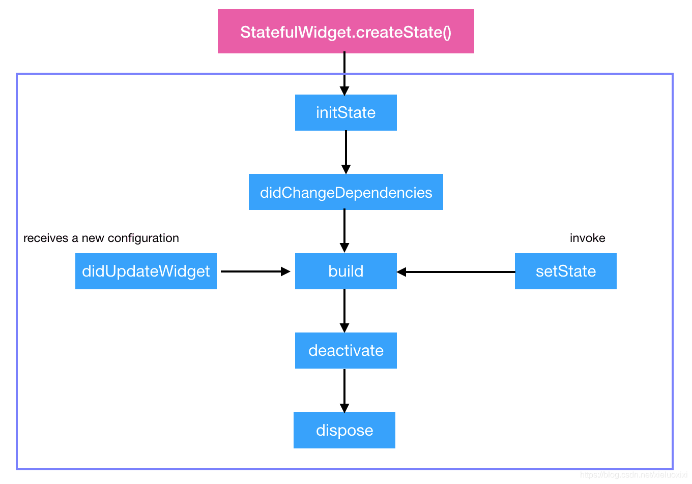
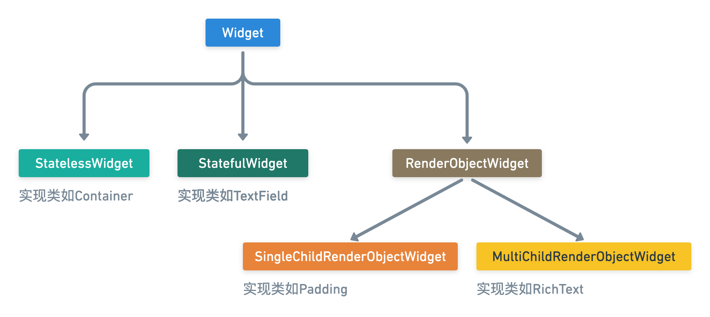

> 本文为 Flutter 系列的第四弹，意在介绍 Widget 的生命周期及 Element Tree

## 生命周期

生命周期是对有状态 Widget 而言的，始于 State 的创建，终于 State 的销毁，整个生命周期如下图所示：



各生命周期函数如下表所示：

| 生命周期函数               | 触发时机                                                     |
| -------------------------- | ------------------------------------------------------------ |
| initState()                | State**插入 Element Tree 后**调用                              |
| didChangeDependencies()    | 首次调用：**紧接 initState()**<br/>二次调用：<br/>**1.Widget 层级变动（在树中的位置发生变动）**<br/>**2.祖先 Widget 类型变动** |
| build(context)             | rebuid 时调用                                                 |
| deactivate()               | State**从 Element Tree 移除后**调用                            |
| dispose()                  | State**从 Element Tree 永久移除后**调用                        |
| didUpdateWidget(oldWidget) | **父 Widget 调用 setState()**                                   |

可见触发 Widget rebuid 的途径有三：

- Widget 自身 setState 改变内部状态
- Widget 层级变动/祖先 Widget 类型变动
- 父 Widget 调用 setState


## Element Tree 的构建和 BuildContext

推荐系列文章[《浅入深出 Flutter Framework》](https://zxfcumtcs.github.io/2020/05/01/deepinto-flutter-widget/)

想要了解 Element Tree，首先要搞清楚 Widget 和 Element 是什么东西

> [Widget](https://api.flutter.dev/flutter/widgets/Widget-class.html): Describes the configuration for an [Element](https://api.flutter.dev/flutter/widgets/Element-class.html).
>
> Widget 是对 Element 的配置的描述

> [Element](https://api.flutter.dev/flutter/widgets/Element-class.html): An instantiation of a [Widget](https://api.flutter.dev/flutter/widgets/Widget-class.html) at a particular location in the tree.
>
> Element 是 Widget 在「树」中特定位置的实例化

官方的定义看得云里雾里，又多了一个「树」究竟是什么？下面就来一一揭秘

首先来了解 Flutter 中的三棵树

- **Widget Tree**-平时编码时使用的各种内置 Widget 或各种自定义 Widget，他们是由各种更小的 Widget 组合而成的，其本身就是一种树状结构，这就是 Widget Tree
- **RenderObject Tree**-Flutter 最终要把我们编写的 Widget 渲染出来靠的是 RenderObject Tree，其中的节点叫`RenderObjcet`，这些节点负责处理视图的布局和绘制
- **Element Tree**-Widget 是不稳定的，一旦 rebuild，其子 Widget 都不可避免的跟着 rebuild，如果直接解析 Widget Tree 生成 RenderObject Tree 就会非常消耗性能。因此 Flutter 在 Element Tree 和 RenderObject Tree 间引入了 Element Tree，Element Tree 将 Widget 的变化做了抽象，使用类似与 React 虚拟 dom 中的 diff 算法来复用节点，最后只将真正需要变化的部分同步到 RenderObject Tree 中，减少渲染开销


其中 Widget 跟 Element 一一对应，但 Widget 不一定对应一个 RenderObject，只有当 Widget 继承自`RenderObjectWidget`时（如 Padding、Row 这些需要渲染的 Widget）才会有对应的 RenderObject

------

回到上面的官方定义，下面从源码来了解 Widget 和 Element 之间的关系，先看 Widget 的源码

```dart
// 基类 Widget
abstract class Widget extends DiagnosticableTree {
	const Widget({ this.key });
  
  @protected
  Element createElement();
}

// 无状态 Widget
abstract class StatelessWidget extends Widget {
  @override
  StatelessElement createElement() => StatelessElement(this);
  
  @protected
  Widget build(BuildContext context);
}

// 有状态 Widget
abstract class StatefulWidget extends Widget {
  @override
  StatefulElement createElement() => StatefulElement(this);

  @protected
  @factory
  State createState();
}

// RenderObject Widget
abstract class RenderObjectWidget extends Widget {
  @override
  RenderObjectElement createElement();

  @protected
  RenderObject createRenderObject(BuildContext context);

  @protected
  void updateRenderObject(BuildContext context, covariant RenderObject renderObject) { }

  @protected
  void didUnmountRenderObject(covariant RenderObject renderObject) { }
}
```



Widget 抽象基类有三个派生抽象类，分别是`StatelessWidget`、`StatefulWidget`和`RenderObjectWidget`。Widget 基类定义了所有 Widget 都必须有`createElement()`方法，用于构建 Widget 对应的 Element

三种 Widget 中，RenderObjectWidget 是基石般的存在，其特殊之处就是能通过`createRenderObject()`方法来构建 RenderObject 这个负责布局和绘制的对象。相比之下，StatelessWidge 和 StatefulWidget 没办法构建 RenderObject，他们只能作为中间层，在`build()`方法中组合其他 Widget（当然，如果继续追踪这些“其他 Widget”最终也会得到 RenderObjectWidget）


再看 Element 的源码，

```dart
// 基类 Element
abstract class Element extends DiagnosticableTree implements BuildContext {
  Element(Widget widget)
    : assert(widget != null),
      _widget = widget;
  
}
// 组件 Element

// 无状态 Element

// 有状态 Eleemnt

// RenderObjectElement
```


## 其他

- pageView 页面缓存 https://juejin.cn/post/6844903660816695309

