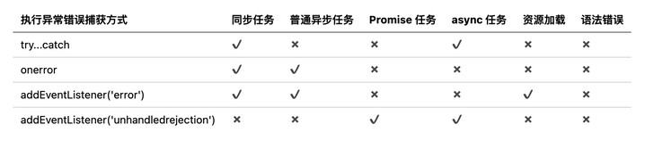

##### hippy 原理

分别基于 React-reconciler、和 Vue-createRender 实现自定义渲染器，支持上层使用 React/Vue 进行编写

Hippy 自己实现了类似React Native 中的 Fabric 架构，中间层使用 C++ HippyCore 负责抹平平台差异性和提供高性能模块，原理是通过`internalBinding`直接共享 JS 和 C++ 运行环境和数据，将C++ 开发的模块暴露给 JS 引擎调用，实现更高效的前端终端通讯

##### for in 和 for of的区别

`for in` 可以遍历到对象上的所有属性名和方法名，**包括其原型链上定义的**属性名和方法名

`Object.keys()`可以得到对象上的属性名和方法名集合，**不包括原型链上的**

`for of`只能用于实现了`Iterator`的对象，可以遍历对象上的属性值，**不包括原型链上的**

##### useEffect 和 userLayoutEffect 的区别

`useEffect`和`useLayoutEffect`的执行时机不一样

- `useEffect`前者被异步调度，当页面渲染完成后再去执行，不会阻塞页面渲染。
- `useLayoutEffect`在 commit-layout 阶段新的DOM准备完成，但还未渲染到屏幕之前，同步执行。

##### React 合成事件机制

React提供了一种“顶层注册，事件收集，统一触发”的事件机制，React 的事件处理机制可以分为两个阶段：

- 初始化时在 root 节点上**监听所有原生事件**，为每个原生事件都绑上一个事件处理函数，持有一个优先级（ListenerWrapperWithPriority）；
- 原生事件触发时，root 上对应的事件处理函数会被执行，按照事件的优先级调度接下来的工作：
  - **构造合成事件对象**
  - **从触发节点对应的 fiber 开始向上收集真正的事件处理函数**（`listeners`）
  - **根据冒泡还是捕获，正序/逆序执行收集到`listeners`，共享同一个合成事件**。每个`listener`执行前，都会检查合成事件对象是否调用阻止冒泡的方法，并且将对应的元素作为 currentTarget 挂载到事件对象，最终执行`listener`

合成事件在符合 W3C 规则的前提下，抹平浏览器间的差异，对关联事件进行合成，简化事件逻辑

##### React 和 Vue 的区别

- Vue 默认使用模板语法：模板、样式、逻辑；React 默认使用 JSX，更贴近原生 JS，对 TS 友好
- Vue 一个组件就是一个文件，而 React 中的组件实质上是一个类/函数，可以以变量的形式存在于同一文件内
- Vue 是推模型，数据变动时界面会自动更新；React 是拉模型，数据变动时需要手动触发更新

##### 浏览器的线程和进程

浏览器是进程的

- Browser 进程（唯一）
- GPU 进程（唯一）
- 插件进程（一个插件对应一个）
- Renderer 进程（一个 tab 对应一个）

Renderer 进程是多线程的：

- GUI 线程，负责页面的解析、布局和绘制
- JS 引擎线程，负责解析执行 JS 代码
- 事件触发线程，负责将满足触发条件的任务（Promise等）加入到任务队列中等待处理
- 定时器线程，单独负责计时，把到期的定时任务加入到任务队列中等待处理
- 网络请求线程，一个请求对应一个线程，请求状态变更后将回调任务加入到任务队列中等待处理

##### 错误捕获和上报

错误类型：JS 执行错误（同步/异步）、资源加载错误（图片/script）、语法错误、普通异步错误（setTimeout）

错误捕获

- `try-catch`
- `window.onerror`
- `window.addEventListener('error')`
- `window.addEventListener('unhandledrejection')`捕获未 catch 的异步错误

数据上报

- HTTP 请求——受同源限制，会被页面 unload 取消
- Image.src——可跨域，但受限于 get 方法数据量有上限
- `navigator.sendBeacon()`——可跨域，甚至不受 unload 影响