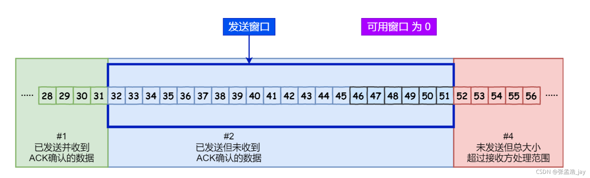
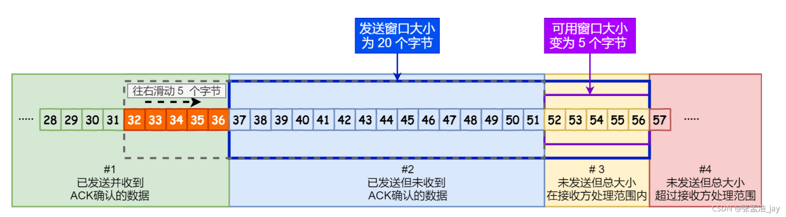

### TCP 和 UDP

#### TCP 和 UDP 区别

TCP 和 UDP **都是传输层的通信协议**，但是两者的机制和适用场景有所不同

- UDP 是**无连接**的，即收即发；TCP 是**有连接**的，发送数据前需要建立连接（三次握手）
- UDP 是**不可靠传输**；TCP 是**可靠传输**，拥有拥塞控制、超时重传等机制保证数据无差错的传输
- UDP 是**面向报文**的；TCP 是**面向字节流**的，应用层的报文被看作字节流，被拆分成多个 TCP 帧发送
- UDP 支持**N对N通信**；TCP 是**一对一的全双工通信**

TCP 的特点是可靠但是效率慢，适用于**对数据完整性和准确性要求高**的场景，比如文件/邮件的传输

UDP 的特点是不可靠但效率，适用于**对通信速度要求高，但对完整性和准确性要求相对较低**的场景，比如 DNS、直播等实时通信

#### TCP 三次握手建立连接

> 发送 SYN 包必定会指定自己的初始序列号，发送 ACK 包必定会以确认号回应对方的序列号

1. 客户端发送 SYN 包，表示请求建立连接
2. 服务端发送 SYN-ACK 包回应，表示同意建立连接
3. 客户端发送 ACK 报文，连接建立

为什么要第三次握手

- 两次握手的话，**接收端无法确定自身发送能力和对方接收能力**
- 两次握手的话，**因网络阻塞延时到达失效 SYN 包又会与服务器建立连接，浪费服务器资源**

#### TCP 四次挥手断开连接

> TCP 的关闭操作任意一方都能发起
>
> 发送 FIN 包必定会指定自己的序列号，发送 ACK 包必定会以确认号回应对方的序列号

1. 客户端发送 FIN 包，表示请求断开连接
1. 服务端发送 ACK 包应答，表示收到断开请求，并发送剩余数据
1. 服务端无数据发送后发送 FIN 包，表示自己也要断开了
1. 客户端发送 ACK 包应答，表示收到断开请求

客户端在收到 FIN 包并发送 ACK 包不会马上断开连接，而是会至少等待一段时间，为的是确保自己的 ACK 能被服务端接收到。如果服务端重传了 FIN，客户端能在等待的时间内捕捉到并重传 ACK

为什么四次挥手

- 客户端发送 FIN 报文后，表示客户端不再发送数据但是还能接受数据，此时**服务端可能还有数据传给客户端，因此 FIN 和 ACK 报文需要分开发送**

| 三次握手                                                     | 四次挥手                                                     |
| ------------------------------------------------------------ | ------------------------------------------------------------ |
|  |  |

#### TCP 滑动窗口（流量控制）

> TCP 利用滑动窗口来实现流量控制，即控制发送方的发送速率，使其在接收方接收能力范围之内尽可能快

> 一个 ACK 包携带了一个 ack 序号，表示接收方已经收到 ack 之前的数据（累计确认）
>
> 接收方每收到一个包都需要立马响应一个 ACK 包

发送缓冲区分四个区间：**#1已收到 ACK 包的数据**、**#2已发送还未接收到 ACK 包的数据**、**#3允许发送但是还未发送的数据**、**#4不允许发送的数据**。区间 #2 和区间 #3 构成发送窗口，可以用三个变量来描述发送窗口

1. `SND.UNA`指向第一个已发送但是未接收到 ack 的字节
2. `SND.NEXT`指向第一个未发送的字节
3. `SND.WND`发送窗口的大小

**只要发送窗口内还有未发送的数据，发送方就会不停的组包发送**（更新`SND.NEXT`）

**只要收到 ack 包，就让发送窗口右移动**（更新`SND.UNA`让其指向 ack 序号）

#### TCP 拥塞控制

发送方维护一个**拥塞窗口大小**`cwnd`和**慢开始阈值**`ssthresh`，根据网络拥塞情况在每个传输轮次中动态调整拥塞窗口的大小，为发送窗口的大小设置提供参考

- 当`cwnd < ssthresh` 时，使用慢开始算法。
- 当`cwnd > ssthresh` 时，停止使用慢开始算法而改用拥塞避免算法。
- 当`cwnd = ssthresh` 时，即可使用慢开始算法，也可使用拥塞避免算法

**慢开始算法**：在阈值以下，让`cwnd`**每经过一个传输轮次增大一倍**

**拥塞避免算法**（加法增大）：在阈值以上，让`cwnd`**每经过一个传输轮次加一**

无理论是在慢开始还是拥塞避免阶段，如果发现**确认超时**（返程拥堵），就会让`ssthresh = cwnd/2`，让`cwnd`重置为1并重新进行慢开始算法

**快重传**：发送方连续收到`三个重复确认`，需要立即重传对方未受到的报文

**快恢复**（乘法减小）：发送方连续收到`三个重复确认`（去程拥堵），让`cwnd = ssthresh = cwnd/2`，重新执行拥塞避免算法

### HTTP

#### 常用状态码及请求头

常见状态码

- `100`等待剩余请求、`101`请求协议切换
- `200`、`201`已创建、`202`已接收正处理、`206`处理了部分请求（断点续传/大文件加载）
- **`301`永久重定向、`302`临时重定向、`304`资源无修改**
- `401`未授权、`403`禁止访问、`404`、`405`方法禁止、`406`不接受（无法满足 Accept 字段）、`408`超时
- `500`内部错误、`502`错误网关、`503`服务不可用、`504`网关超时

常见请求头

| 字段              | 说明             | 示例                              |
| ----------------- | ---------------- | --------------------------------- |
| accept            | 接受内容类型     | application/json                  |
| accept-charset    | 接受字符编码     | utf-8                             |
| accept-encoding   | 接受编码格式     | gzip,deflate                      |
| accept-language   | 接受的语言       | zh-CN                             |
| cache-control     | 缓存控制         | no-cache                          |
| connection        | 期望连接类型     | Upgrade                           |
| content-length    | 请求体长度       | 233                               |
| content-type      | 请求体mime类型   | application/x-www-form-urlencoded |
| cookie            | cookie           | var1='233'                        |
| date              | 请求发送时间     | Tue, 15 Nov 1994 08:12:31 GMT     |
| host              | 服务器域名和端口 | oshinonya.com                     |
| if-none-match     | 协商缓存策略     | 资源etag                          |
| if-modified-since | 协商缓存策略     | 资源最后修改时间                  |
| origin            | 跨域请求发起源   | https://oshinonya.com             |
| range             | 请求部分资源     | bytes=0-511                       |
| referer           | 请求的发起页面   | https://oshinonya.com             |
| user-agent        | 浏览器身份标识   | - -                               |

常见响应头

| 字段                                  | 说明                            | 示例                         |
| ------------------------------------- | ------------------------------- | ---------------------------- |
| access-control-allow-*                | 跨域设置                        | - -                          |
| cache-control                         | 缓存控制                        | public, max-age=3600         |
| content-disposition                   | 弹出下载框，指定文件名          | attachment;filename=“me.png” |
| content-encoding/language/length/type | 同上                            | - -                          |
| etag                                  | 资源标识符                      | - -                          |
| expires                               | 资源过期时间                    | - -                          |
| last-modified                         | 资源最后修改时间                | - -                          |
| location/refresh                      | 重定向/支持延迟的重定向         | https://oshinonya.com        |
| set-cookie                            | cookie设置                      | var1=‘2333’                  |

#### 浏览器缓存

分为强缓存和协商缓存，**强缓存优先级更高**

- **强缓存**，在客户端判断。客户端根据`cache-control`和`expires`字段（前者优先级更高）来判断资源是否命中强缓存
- **协商缓存**，在服务端判断。当强缓存没命中时，客户端通过`if-none-match`字段携带资源`etag`或`if-modified-since`字段携带资源`last-modified`发往服务端，由服务器指示客户端是否使用缓存（`304`）

#### GET 和 POST 的区别

- 知道`GET`请求参数放在`url`中（在地址可见），`POST`则放在`body`中
- `GET`请求参数只接收 ASCII 字符，`POST`无限制
- `GET`请求参数有长度限制，`POST`无限制
- `GET`请求会被浏览器主动缓存，`POST`不会，除非手动设置
- `GET`请求在浏览器中是 header、data 一并发送的，而`POST`一般会分开发送
- `GET`请求浏览器回退无害，`POST`会再次提交请求

#### HTTP的各个版本

HTTP1.0：

- 浏览器与服务器只保持短暂的连接，浏览器的每次请求都需要与服务器建立一个TCP连接

HTTP1.1：

- 引入了持久连接，即TCP连接默认不关闭，可以被多个请求复用
- 虽然TCP连接被复用了，但是同一个TCP连接里面，所有的数据通信是按次序进行的
- 新增了一些请求方法（PUT、OPTIONS）
- 新增了一些请求头和响应头（缓存策略相关等）

HTTP2.0：

- 【二进制分帧】将请求和响应数据分割为多个帧，并采用二进制编码，帧之间可乱序发送
- 【多路复用】完全多路复用，一个连接里，双方都可同时发送多个请求或响应，而非有序并阻塞的
- 【首部压缩】双方都维护“首部表”记录之前 Header 键值对，下次发送只携带有差异的 Header
- 【服务器推送】服务器可以顺便把客户端接下来需要的资源一并推送

### HTTPS

> 非对称加密：公钥加密私钥解密（加密通信）、私钥加密公钥解密（签名认证）
>
> 证书授权中心（CA）：作为可信的第三方为服务器颁发证书，证书由明文和签名组成
>
> - 明文：包含服务器公钥和绑定的域名等信息
> - 签名：经 CA 私钥加密过的明文摘要
>
> 客户端证书验证：
>
> - 客户端使用指定摘要算法计算明文摘要 hash1
> - 客户端使用 CA 公钥解密证书签名得到明文摘要 hash2
> - 比较 hash1 hash2 是否相等

HTTP 采用明文传输，存在被截获窥视篡改的风险，而且双方不能互相验证身份的真伪

HTTPS 在 HTTP 的基础上使用 TLS/SSL 进行加密，实现信息的加密、完整性校验和身份认证。HTTPS 在 TCP 握手后还需要进行 TLS 的握手，握手过程根据 key 交换算法的不同有差异，这里以 RSA 为例

- 【1】浏览器发起`Client Hello`携带自己支持的 TLS 版本、加密套件，随机数`clientRandom`
- 【2】服务器响应`Server Hello`携带确认选择的 TLS 版本、加密套件，随机数`serverRandom`
- 【3】服务器响应`certificate`携带服务器证书
- 【4】服务器响应`Server Hello Done`表示发送完毕
- 浏览器收到服务器证书后用内置 CA 证书验证服务器证书合法性，如果通过验证，继续下面的流程
- 【5】浏览器发送`ClientKeyExchange`，携带公钥加密的`premaster secret`
- 服务器使用私钥解密出`premaster secret`，双方连同之前的两个随机数计算出会话密钥
- 【6】浏览器发送`ChangeChiperSpec`、会话密钥加密的`EncryptedHandshakeMessage`（供服务器验证）
- 【7】服务器同样响应`ChangeChiperSpec`、会话密钥加密的`EncryptedHandshakeMessage`（供浏览器验证）

之后双方的通信都基于会话密钥的对称加密之上进行

