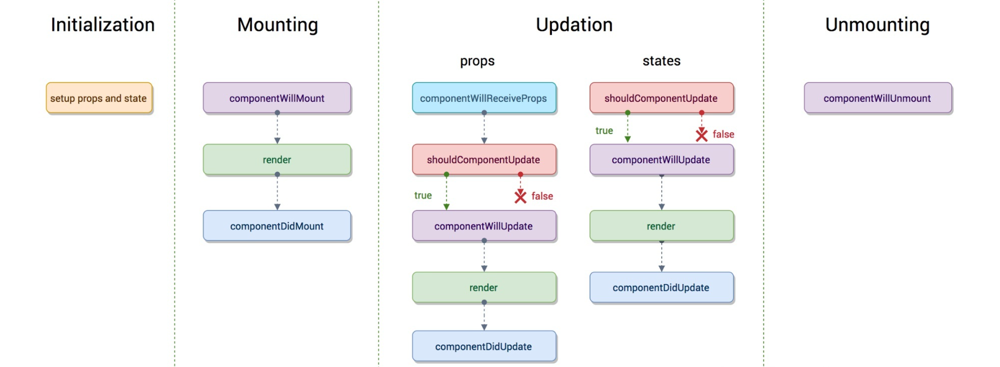
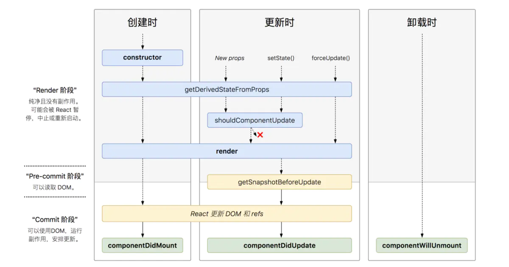

### Hooks

#### useContext

在类组件时代，我们使用 Context API 来实现跨组件数据传递

- 创建一个`context`，设置数据兜底值
  - ```tsx
    export const XXXContext = React.createContext<AccountInfo>({ name: '', age: 18 })
    ```
  
- 使用`context.Provider`组件将`context`连同要传递的数据`value`提供给（注入到）子孙组件中
  - ```tsx
    <XXXContext.Provider value={accountInfo}>
      {/** 需要跨组件传递 */}
    </XXXContext.Provider>
    ```
  
- 在子孙组件中使用`context.Consumer`组件订阅`context`的变化，在`value`变化时重新渲染内部组件

  - 对于同一个`context`的多个 provider，取最近祖先 provider 的 `value`

  - 如果没有祖先 provider，取`context`的兜底值

  - 该重渲染无视`shouldComponentUpdate`和`React.memo`的作用

  - ```tsx
    <XXXContext.Consumer>
    { // 消费
    	({ name, age }) => <Text>{`${name}-${age}`}</Text>
    }
    </XXXContext.Consumer>
    ```


需要透传多组数据时，需要嵌套多个 provider，这是无法避免的

consumer 作为组件的用法决定了一个节点如果也想要订阅多组数据，就必须像 provider 一样嵌套使用，看起来不是那么美观

而`useContext`配合函数组件就能很优雅的解决这个问题，他是函数组件中 consumer 的接替者

```tsx
const ComponentA: React.FC = () => {
	const { name, age } = useContext(XXXContext);
  return <Text>{`${name}-${age}`}</Text>
}
```

`useContext()`接收目标`context`并返回其`value`（由最近祖先 provider 决定），当`value`发生变化时，使用该 hook 的整个组件都会重渲染，因此使用时应该遵循“作用范围最小化”的原则

#### useReducer

`useReducer`和`useState`一样是一个用于状态管理的 hook，`useState`相当于一个特化的`useReducer`

`useReducer`接受一个`reducer`和状态初始值`initValue`，返回当前状态和一个分发器`dispatch`。重点讲下入参`reducer`和出参`dispatch`

- 【reducer】action 处理回调，在 action 被分发后调用，其返回值将作为更新后的 state
- 【dispatch】action 分发器，action 可以是任意类型的数据，通过`dispatch(action)`分发一个 action；在组件 rerender 时，dispatch 的引用并不会改变

下面是一个利用`useReducer`封装的请求数据的 hook

```ts
interface FetchData {
  loading: boolean;
  errorMsg: string;
  data: Record<string, any> | null;
}

enum ActionType {
  FetchStart,
  FetchSucc,
  FetchError,
}

interface IAction {
  type: ActionType;
  payload?: Record<string, any>;
}

/** 定义 reducer 处理 action，返回更新后的 state */
const reducer = (state: FetchData, action: IAction): FetchData => {
  switch (action.type) {
    case ActionType.FetchStart:
      return {
        loading: true,
        ...state,
      }
    case ActionType.FetchSucc:
      return {
        loading: false,
        error: '',
        data: action.payload,
      }
    case ActionType.FetchError:
      return {
        loading: false,
        error: 'something went wrong',
        data: null,
      }
    default:
      return state
  }
}

/** 利用 useReducer 封装一个获取请求数据的 hook */
const useFetchData = async () => {
  const [fetchData, dispatch] = useReducer(reducer, initialState)
  useAsyncEffect(async () => {
    try{
      // 在不同的阶段分发不同的 action
      dispatch({ type: ActionType.FetchStart })
      const data = await fetchData();
      dispatch({ type: ActionType.FetchSucc, payload: data })
    }catch(error) {
      dispatch({ type: ActionType.FetchError })
    }
  }, [])
  
  return fetchData
}

```

可以看见，`useReducer`可以把若干个强关联的状态很好的绑定在一起，把他们的变化逻辑统一收敛到 reducer 中，通过派发语义化的 action 来区分执行（就像 redux 一样，配合`useContext`更是能实现 redux 全局状态管理的效果）；当然同样的逻辑也可以使用`useState`来实现，这需要把原来 dispatch 的地方改为具体的状态更新代码

上面的代码很容易给人“这总情况下，使用`useReducer`会更好的”的想法，其实不然，因为`useState`经过良好的封装，也是能非常优雅的使用的，哪个更合适还得看具体场景和个人习惯。个人觉得，以下情况如果出现了多种是可以考虑使用`useReducer`来代替`useState`的：

- 多个状态相互关联
- state 的变化逻辑在多个地方出现，需要复用
- state 的变化逻辑较多且复杂

### 生命周期

React 的生命周期以 16.3（Fiber引入） 为分界线分为新老两种生命周期

#### 老生命周期

老生常谈了

挂载时调用顺序

- `componentWillMount`
- `render`
- `componentDidMount`

更新时调用顺序

- `componentWillReceiveProps(nextProps)`（父组件引起的重渲染特有）
- `shouldComponentUpdate(nextProps, nextState)`返回布尔值指示是否执行下面的更新逻辑
- `componentWillUpdate`
- `render`
- `componentDidUpdate`

卸载时调用顺序

- `componentWillUnmount`



#### 新生命周期

将`componentWillXXX()`系列声明周期 API 标记为不建议使用，因为 Fiber 架构的引入使得更新过程不再同步，而是异步可中断的，可能会导致这些这些`render()`之前的钩子函数被执行多次，与原来的表现不一致

React 引入了`getDerivedStateFromProps()`**静态函数**（限制开发者编写副作用代码）来接替上面不建议使用的`componentWillXXX()`，该函数可根据新的 props 和之前的 state 来在`render()`之前最后一次调整当前的 state

```ts
static getDerivedStateFromProps(nextProps, prevState) {
  //根据nextProps和prevState计算出预期的状态改变，返回结果会被送给setState
  // return newState
}
```

React 还引入了一个新的生命周期函数`getSnapshotBeforeUpdate()`，该函数会紧接 update 的`render()`之后执行，此时DOM还未更新，可以记录并返回一些快照信息`snapshot`，这个返回的`snapshot`将作为`componentDidUpdate`的第三个参数传入


